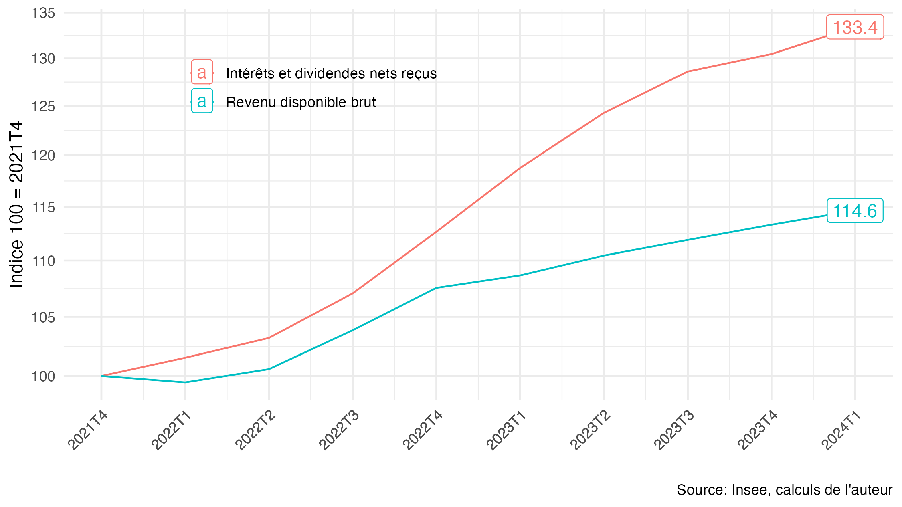
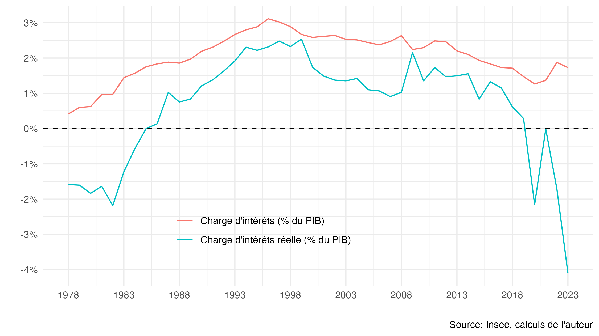
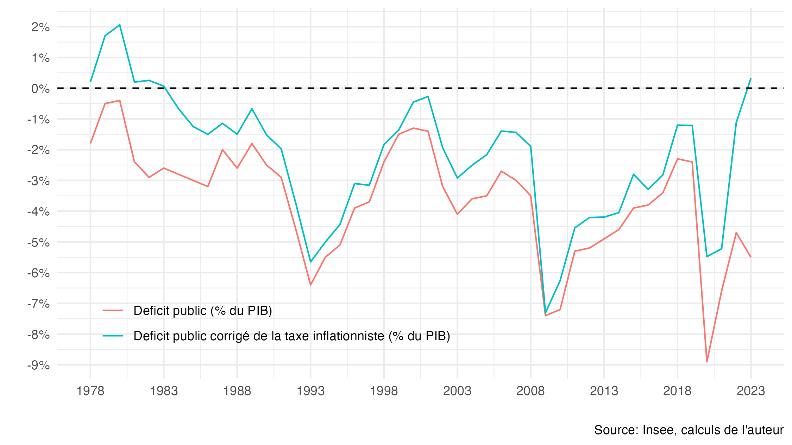

# La taxe inflationniste, le pouvoir d’achat, le taux d’épargne et le déficit public

## Réplication

Le dépôt contient de quoi répliquer les figures et les données de la [note en lien](https://fgeerolf.com/taxe-inflatoinniste.pdf):

### Figure 1 : Croissance des intérêts et dividendes nets reçus, et du revenu disponible brut (2021T4-)

[Code R](figure1.R)

### Figure 2 : Charge d'intérêt vs. charge d'intérêt réelle (% du PIB)

[Code R](figure2.R)

### Figure 3 : Déficit public et déficit public corrigé de la « taxe inflationniste » (% du PIB)

[Code R](figure3.R)

